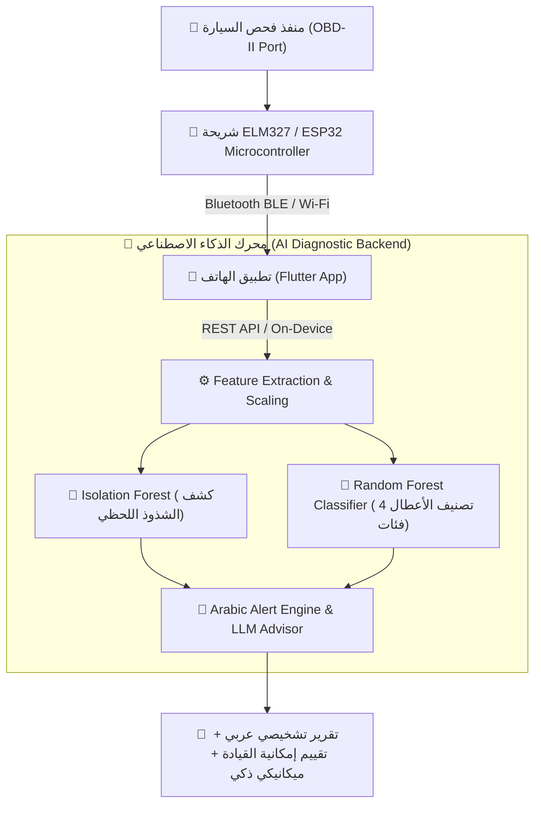

# 🚗 Smart OBD-II Electrical Diagnostic System ⚡
### نظام التشخيص الكهربائي التنبؤي الذكي للسيارات عبر فيشة الفحص OBD-II

[](https://www.python.org/)
[](https://fastapi.tiangolo.com/)
[](https://scikit-learn.org/)
[](https://opensource.org/licenses/MIT)

مشروع تخرج متكامل يجمع بين تقنيات **إنترنت الأشياء (IoT)**، **تعلم الآلة (Machine Learning)**، و**الذكاء الاصطناعي التوليدي (LLMs)** لقراءة وتحليل القياسات الكهربائية اللحظية للسيارة (Live Telemetry) عبر منفذ الفحص OBD-II (باستخدام شريحة ELM327 ومتحكم ESP32)، والتنبؤ بأعطال البطارية والدينامو والتسريب الكهربائي قبل وقوعها، مع تقديم تنبيهات واستشارات تفاعلية باللغة العربية البسيطة لسائق السيارة.

---

## 📑 جدول المحتويات (Table of Contents)
1. [نظرة عامة ومخطط النظام (System Architecture)](#-نظرة-عامة-ومخطط-النظام)
2. [البيانات والميزات المستهدفة (Target Features)](#-البيانات-والميزات-المستهدفة)
3. [مولد البيانات الفيزيائية الاصطناعية (Synthetic Data Generator)](#-مولد-البيانات-الاصطناعية)
4. [نماذج الذكاء الاصطناعي (AI & ML Models)](#-نماذج-الذكاء-الاصطناعي)
5. [محرك الاستشارة والترجمة باللغة العربية (Arabic Alert & LLM Advisory)](#-محرك-الاستشارة-والتنبيه-باللغة-العربية)
6. [الواجهة البرمجية (FastAPI REST Server)](#-الواجهة-البرمجية-fastapi-backend)
7. [طريقة التثبيت والتشغيل (Quick Start Guide)](#-طريقة-التثبيت-والتشغيل)
8. [التشغيل على الموبايل (Flutter & On-Device ONNX Export)](#-التشغيل-على-الموبايل)

---

## 🏗️ نظرة عامة ومخطط النظام



---

## ⚡ البيانات والميزات المستهدفة (Target Features)

| الخاصية (Feature) | الوصف الهندسي | النطاق النموذجي السليم |
| :--- | :--- | :--- |
| `resting_voltage_v` | جهد البطارية أثناء السكون (Engine OFF) | $12.45\text{V} - 12.75\text{V}$ |
| `min_cranking_voltage_v` | أدنى جهد مسجل أثناء دوران بادئ التشغيل (Starter) | $> 9.60\text{V}$ (معيار SAE J537) |
| `cranking_voltage_sag_v` | مقدار الهبوط اللحظي في الجهد أثناء التدوير | $< 2.80\text{V}$ |
| `running_voltage_mean_v` | متوسط شحن الدينامو أثناء عمل المحرك | $13.80\text{V} - 14.45\text{V}$ |
| `load_voltage_drop_v` | مقدار هبوط الجهد عند تشغيل المكيف والأحمال العالية | $< 0.30\text{V}$ |
| `voltage_ripple_mean_v` | تموج الجهد وتذبذب التيار (AC Ripple Noise) | $< 0.05\text{V}$ |

---

## 🔬 مولد البيانات الاصطناعية (Synthetic Generator)

تم بناء محرك فيزيائي يحاكي 4 أنماط تشغيلية وعطلية كاملة:
- **الفئة 0 (Normal Healthy State):** منظومة سليمة، جهد شحن وتدوير قياسي.
- **الفئة 1 (Battery Degradation):** تدهور خلايا البطارية، هبوط الجهد أثناء التدوير إلى أقل من $9.6\text{V}$ ($6.7\text{V} - 9.4\text{V}$).
- **الفئة 2 (Alternator Issue):** شحن ضعيف ($< 13.2\text{V}$)، شحن زائد خطير ($> 15.2\text{V}$)، أو تلف دايود التقويم (Ripple $> 0.35\text{V}$).
- **الفئة 3 (Parasitic Drain / High Resistance):** تسريب تيار سكوني مستمر أو مقاومة تأريض مرتفعة تؤدي لهبوط حاد عند تشغيل الملحقات.

### تشغيل المولد:
```bash
python generate_dataset.py --sessions-per-pattern 50 --duration-sec 60
```

---

## 🤖 نماذج الذكاء الاصطناعي (AI Models)

1. **Isolation Forest (Anomaly Detection):** يراقب المؤشرات الكهربائية لاكتشاف القراءات الشاذة وغير المألوفة.
2. **Random Forest Classifier (Multi-Class Diagnostic):** تصنيف دقيق لحالة النظام إلى 4 فئات بدقة **100%** و F1-Score **1.00**.

### تدريب النماذج وتقييمها:
```bash
python src/models/train_models.py
```

---

## 🗣️ محرك الاستشارة والتنبيه باللغة العربية

يدمج النظام محركين:
1. **Arabic Rule/NLP Alert Engine:** توليد كائن JSON لحظي وفوري يحدد:
   - كود الحالة ورتبة الخطورة (`LOW`, `MEDIUM`, `CRITICAL`).
   - رسالة تنبيهية مباشرة لسائق السيارة.
   - هل القيادة آمنة حالياً (`safe_to_drive`).
   - خطوات الصيانة والإصلاح المقترحة.
2. **Automotive LLM Advisor:** مستشار الذكاء الاصطناعي التوليدي عبر الـ API (DeepSeek / OpenAI / Groq) لتقديم تقارير ميكانيكية استشارية وتوفير شات تفاعلي داخل التطبيق مع دعم **Smart Offline Fallback**.

---

## 🌐 الواجهة البرمجية (FastAPI Backend)

### تشغيل الخادم:
```bash
python src/api/app.py
```
أو عبر Uvicorn:
```bash
uvicorn src.api.app:app --host 0.0.0.0 --port 8000 --reload
```

- **رابط التوثيق التفاعلي (Swagger UI):** `http://localhost:8000/docs`

### أهم الـ Endpoints:
- `POST /api/predict`: استقبال قراءات الـ Telemetry وإرجاع التشخيص والتنبيه العربي الكامل.
- `POST /api/advisor/chat`: شات تفاعلي مع "ميكانيكي الذكاء الاصطناعي".
- `GET /`: فحص حالة الخادم والنماذج المحملة.

---

## 🚀 طريقة التثبيت والتشغيل السريع

```bash
# 1. استنساخ المستودع
git clone https://github.com/ohmedayman/obdai.git
cd obdai

# 2. تثبيت الحزم المطلوبة
pip install -r requirements.txt

# 3. إعداد مفتاح الـ API (اختياري للـ LLM)
cp .env.example .env

# 4. توليد البيانات وتدريب النماذج
python generate_dataset.py
python src/models/train_models.py

# 5. تشغيل السيرفر
python src/api/app.py
```

---

## 📱 التشغيل على الموبايل (On-Device Inference)

لتشغيل النماذج محلياً بدون إنترنت داخل تطبيق Flutter أو Android عبر `ONNX Runtime` أو `TFLite`:
```python
import skl2onnx
from skl2onnx.common.data_types import FloatTensorType
import joblib

model = joblib.load("models/electrical_classifier.joblib")
initial_type = [('float_input', FloatTensorType([None, 11]))]
onx = skl2onnx.convert_sklearn(model, initial_types=initial_type)

with open("models/electrical_classifier.onnx", "wb") as f:
    f.write(onx.SerializeToString())
```
ثم يتم استدعاء ملف `electrical_classifier.onnx` مباشرة عبر حزمة `onnxruntime_flutter` في Dart.

---

## 👨‍💻 فريق العمل
مشروع تخرج **Smart OBD-II Electrical Diagnostic System**
- تطوير وهندسة الأنظمة المدمجة والذكاء الاصطناعي (IoT & AI Architecture).
